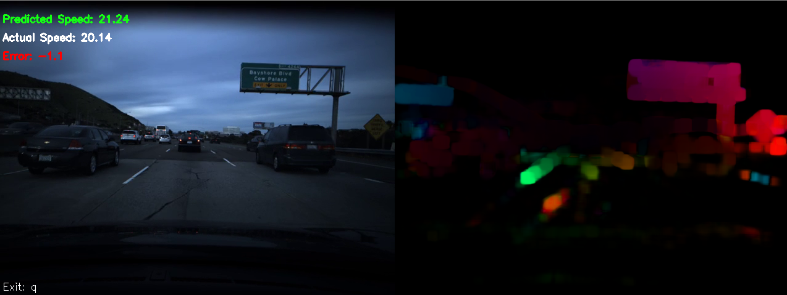

# Comma Speed Challenge

## SNet

This is a dense optical flow neural network for predicting the speed of a car using front-facing camera video feed.

## Solution

## Training
The model for this network is already trained and included in "/models" on this repository.
If you would like to train your own model, you will need a video file of front-facing driving data and a text file for ground truthing speeds at every frame.

First you will need to make the training data set with your video and text file:

`python SNet.py --mode=make_data --video_file=driving_file.mp4 --speed_file=speed_file.txt`

This data file will save as `training_data-{time}.npy` in your current directory. This is what is used to train the model.

To train the model with a data file, use:

`python SNet.py --mode=train --training_data_file=data_file.npy`

Training time will depend on if you are running a CUDA enabled gpu.

## Testing
The model is located in "./models/MODEL-(=55e)-DOF-[full-highway+city]-1601720148.4695241.pth".
To test the model, use:

`python SNet.py --mode=test --model_file=model_file_name.pth --video_file=test.mp4 --speed_file=test.txt`

Note: a speeds file is optional for testing, if ground truths are given for a test video error will be displayed. The model will not be trained during testing.

## Tensorboard
If training new models, to use tensorboard to log training/validation loss and accuracy, use:

`pip install tensorboard`

`tensorboard --logdir="./logs"`

This will launch a server at localhost:6006.

## Next Steps/Theories to Test:
An issue with the current model of this network is that non-static objects cannot be accurately used for optical flow calculation relating to the current vehicle's speed.
When cars in the image drive at equal speeds to the host car, they seem not to move, therefore there is little optical flow resulting in low-speed predictions.
When the host car is at a stop, yet other cars continue driving, large optical flow causes high speed predictions while the host car does not move.

Optical flow of static non-moving objects produces accurate speed prediction for the host car. If you could eliminate all non-static objects from the scene, you would have perfect speed prediction.
Semantic Segmentation is capable of masking objects based on similarity. Dense optical flow could be used to classify other vehicles, mask them with semseg, and thus ignore them from optical flow consideration when calculating speed. This would (theoretically) increase accuracy at a large computational cost.
